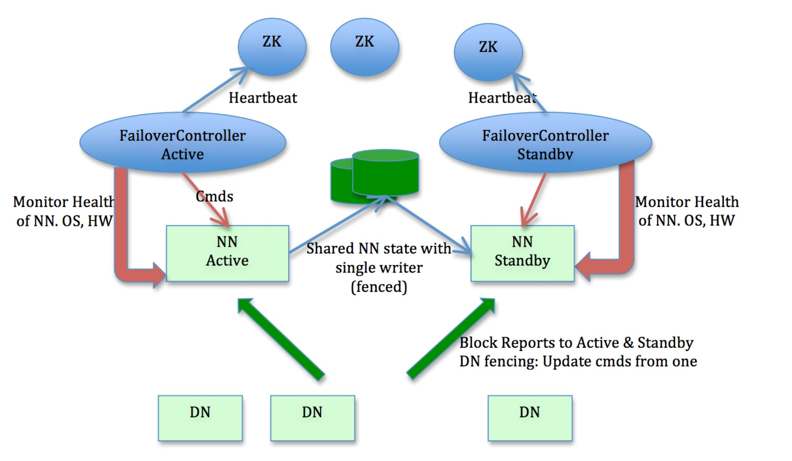

# hadoop-ha-qjm

本示例依赖Docker，完全参考Hadoop-2.7.4官方说明，使用Quorum Journal Manager构建了一个基本高可用的Hadoop集群Demo。  

------------------
~~共创建了3个ZK，3个JournalNode，2个NameNode（主、备），3个DataNode~~  
将ZK的创建单独分离到[zookeeper-cluster](../zookeeper-cluster)。剩余共创建了3个JournalNode，2个NameNode（主、备），3个DataNode。

JournalNode注意事项：
> JournalNode machines - the machines on which you run the JournalNodes. The JournalNode daemon is relatively lightweight, so these daemons may reasonably be collocated on machines with other Hadoop daemons, for example NameNodes, the JobTracker, or the YARN ResourceManager. Note: There must be at least 3 JournalNode daemons, since edit log modifications must be written to a majority of JNs. This will allow the system to tolerate the failure of a single machine. You may also run more than 3 JournalNodes, but in order to actually increase the number of failures the system can tolerate, you should run an odd number of JNs, (i.e. 3, 5, 7, etc.). Note that when running with N JournalNodes, the system can tolerate at most (N - 1) / 2 failures and continue to function normally.

## 结构图


## 构建container并启动
```
docker-compose -f docker-compose-hadoop.yml up -d
```

## 初始化数据
参考官方文档说明:http://hadoop.apache.org/docs/stable/hadoop-project-dist/hadoop-hdfs/HDFSHighAvailabilityWithQJM.html

1. 分别进入JournalNode，启动JournalNode

    ```
    hadoop-daemon.sh start journalnode
    ```

2. 进入任意一个NameNode，格式化NameNode数据

    ```
    hdfs namenode -format
    ```  
3. 使备NameNode同步主NameNode  

    首先启动主NameNode，也就是第2步操作的NameNode，启动
    
    ```
    hadoop-daemon.sh start namenode
    ```
    然后进入备NameNode，执行同步
    
    ```
    hdfs namenode -bootstrapStandby
    ```  
4. 初始化NameNode信息到ZK。在任意NameNode节点执行。（在实验过程中，遇到NameNode无法连接ZK问题，原因是ZK自己启动出现了问题导致的）
    
    ```
    hdfs zkfc -formatZK
    ```
    到这里，节点的初始化已基本结束

5. 停止所有节点，并重新启动
    
    ```
    stop-dfs.sh  
    
    start-dfs.sh && start-yarn.sh
    ```
6. 完成！！！

## 访问地址端口说明
因为示例中有两个NameNode，为了区分，修改了对应的映射。可根据自己喜好修改

NameNode01:

```
- 50071:50070
- 8021:8020
- 8081:8088
- 9001:9000
```

NameNode02:

```
- 50072:50070
- 8022:8020
- 8082:8088
- 9002:9000
```

## 其他说明
1. 运行时，使用了同一份.ssh文件。因为在实验过程中，重新启动container后ssh其他节点，需要重新确认，所以挂载到了本地，并共用一份文件
2. 各个节点的数据挂载到了本地。可根据自己喜好调整数据保存位置
3. 位于$HADOOP_HOME/etc/hadoop下的配置文件，挂载的是同一份
